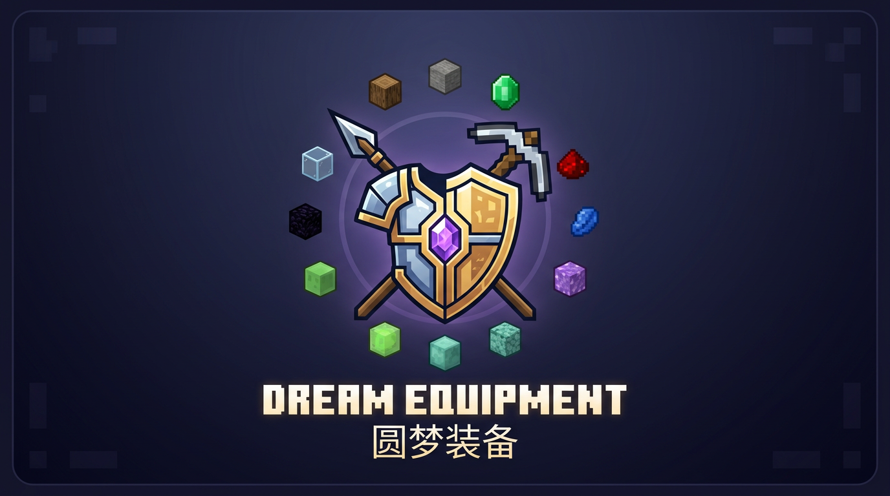

# Dream Equipment / 圆梦装备



Standalone Fabric mod project for Minecraft 26.1.2. The project cover art is stored at `docs/assets/dream_equipment_cover.png` and mirrored in resources as `assets/dream_equipment/cover.png`.

This project is separate from `yansheng-source`; that repository is only a workflow/API reference.

## Environment

- Minecraft `26.1.2`
- Fabric Loader `0.19.3`
- Fabric API `0.152.1+26.1.2`
- Java `25+`
- Gradle wrapper `9.4.1`

## Build

```bash
JAVA_HOME=/tmp/herbcraft-jdk25/jdk-25 bash ./gradlew --no-daemon build --rerun-tasks
```

## Current status

Current baseline: 312 custom items across 56 JSON-defined equipment families. Registration/content is data-driven from `equipment_families.json`; set-effect values and rule tables are data-driven from `set_effects.json`.

Latest checked state: 2026-07-03 vanilla material shield pass after project cover art, vanilla shield recipe disable, custom shield textures/effects, and plank component-mapping art pass. Generator drift check, validators, balance audit, and Gradle build pass with Java 25. Repair tags are generated from JSON-owned `repair_ingredients` when present; coal and wood/log-like armor fuel values are generated from JSON-owned `fuel_burn_time_per_material`; redstone equipment uses JSON-tuned short equip/step pulses with a redstone wire evaluator mixin for dust-line propagation. Wood/plank/log/stem worn equipment layers are regenerated by `scripts/generate_wood_worn_textures.py`; all plank families use component-local vanilla plank mapping, while log/stem families remain on the vanilla-source baseline. Shields are implemented for all Dream Equipment families plus copper/golden/diamond/netherite vanilla-material shield families, with data-driven gameplay effects and material-adapted custom base textures; vanilla shield crafting is disabled to avoid recipe conflicts. Selected cover art is available at `docs/assets/dream_equipment_cover.png`.

## Content

Implemented content:

- Emerald tools and armor
- Wooden armor
- Oak/Spruce/Birch/Jungle/Acacia/Dark Oak/Mangrove/Cherry/Pale Oak/Bamboo/Crimson/Warped armor
- Stone armor
- Mossy cobblestone / Cobbled deepslate / Blackstone / Sandstone / Red sandstone / End stone / Tuff / Calcite armor
- Cobblestone armor
- Cactus armor
- Armadillo shell boots
- Bone armor
- Paper armor
- Glass armor
- Obsidian armor
- Lapis tools and armor
- Redstone tools and armor
- Quartz tools and armor
- Amethyst tools and armor
- Prismarine tools and armor
- Slime armor
- Coal armor

Textures are original generated assets using Vanilla+/vanilla-style direction as reference only.
